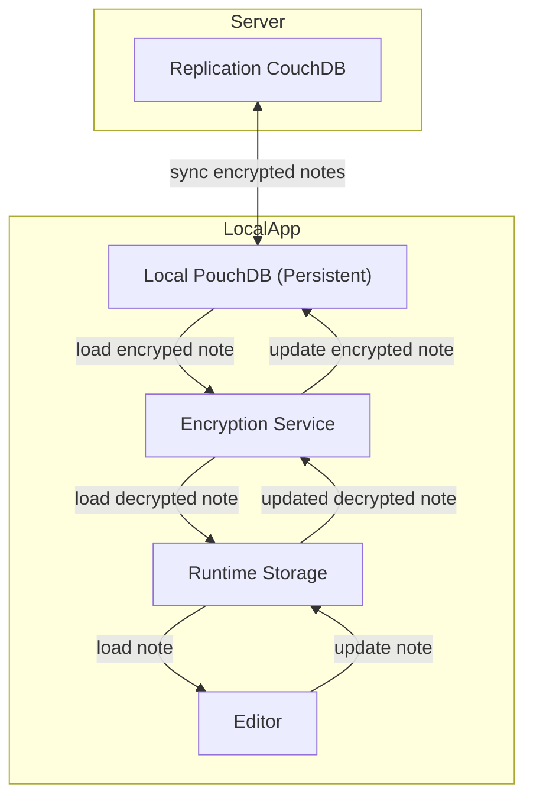

# High level Data Encryption & storage flow

The general idea is to make sure only encrypted data is stored in the pouchDB and therefore persisted on the local client as well as the replication database server.

## General Dataflow

