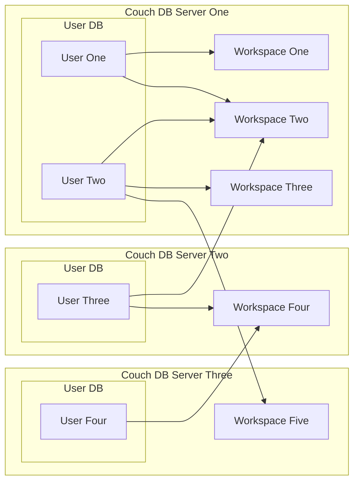

# Users and Workspaces

The Architecture of the notes app allows Users to be registered in private remote databases (or also only locally) but still collaborate with workspaces on different servers!

## Everyone can share workspaces, even across servers!

